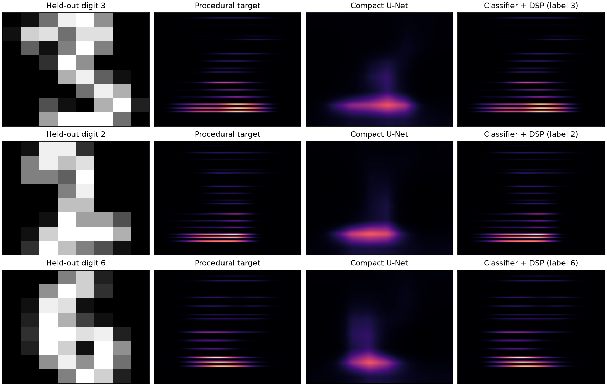

# U-Net: Handwritten Digits to Musical Spectrograms

## Reproducible CPU comparison and listenable results

```bash
python3.13 -m venv .venv
source .venv/bin/activate
pip install -r requirements-cpu.txt
python -m pytest tests -q
OPENBLAS_NUM_THREADS=1 OMP_NUM_THREADS=1 python reproduce.py
```



This bounded experiment uses **sklearn's bundled 8×8 digits**, not
MNIST/EMNIST: 600 training images, 200 held-out images, seed 7, and 300 compact
U-Net updates. Every index, target hash, loss trace and metric is saved in
[metrics.json](results/cpu/metrics.json). No data download or GPU is required.

| Held-out method | Magnitude MSE ↓ | Cosine similarity ↑ |
|---|---:|---:|
| Training-set mean | 0.00594 | 0.561 |
| Compact image-only U-Net | 0.00881 | 0.538 |
| Classify digit, then procedural synthesis | **0.000712** | **0.963** |

The classifier recognizes 95% of held-out digits. Its synthesis uses **predicted
labels only**, plus the input image; target construction uses ground truth.
The image-only U-Net does not beat the mean baseline at this budget. That is an
important limitation rather than a result to hide: recognizing a discrete pitch
class before synthesis works much better for this particular procedural task.
The compact model is an ablation, not the original trained checkpoint. Its
checkpoint reload reproduces predictions exactly; CI uploads the weights.
These are development diagnostics, not an untouched external benchmark.

Listen to the same held-out image as a [target](results/cpu/digit-3-0-target.wav),
[U-Net prediction](results/cpu/digit-3-0-unet.wav), and
[classifier + synthesis](results/cpu/digit-3-0-hybrid.wav). All use the same seeded
phase convention; each file is peak-normalized, so comparisons are qualitative,
not loudness-matched listening tests. More examples are in `results/cpu/`.

### Correctness improvements

The original exact floating-point modulo could omit a major third/fifth whenever
its frequency fell between integer rows. `digit_audio.py` places fractional
harmonics explicitly on the Hz grid. Additive synthesis now uses a single
waveform buffer, seeded phase, sub-Nyquist validation and safe silence handling.
The controls are magnitude images for additive synthesis, **not invertible STFTs**.

The notebook now imports those corrected harmonic/audio functions, seeds its
training run, records every batch loss, and keeps the model it just trained
instead of automatically replacing it with an incompatible historical snapshot.
Use `UNET_CHECKPOINT=/path/to/compatible.pt` only when intentionally loading one.
The standalone path and five regression tests were executed; the revised
full-resolution EMNIST training was not rerun in this pass. Historical outputs
embedded in the notebook are retained as historical, not newly generated evidence.

A cross-modal deep-learning experiment that maps a 28×28 MNIST/EMNIST digit to
a 1008×1008 spectrogram representing a major triad. The project combines a
procedural target-generation pipeline, a PyTorch U-Net, perceptual image losses,
and waveform synthesis.

## Project idea

The historical notebook maps digit/letter labels to semitone offsets. For each input image, the data
pipeline creates a target spectrogram whose vertical structure encodes a
fundamental, major third, and perfect fifth. A U-Net then learns the mapping
while preserving the digit's spatial character through skip connections.

## Technical highlights

- Procedural supervision built with resampling, Gaussian decay and smearing,
  harmonic row selection, and Perlin-noise texture
- Encoder–decoder model with skip connections and a 1008×1008 output
- Huber and multi-scale SSIM objectives for pixel and structural fidelity
- Mixed-precision training and checkpointing in PyTorch
- Spectrogram-to-waveform synthesis for audible qualitative evaluation

## Quick start

```bash
git clone https://github.com/takakhoo/mnist-to-music-unet.git
cd mnist-to-music-unet
python -m venv .venv
source .venv/bin/activate  # Windows: .venv\Scripts\activate
python -m pip install -r requirements.txt
jupyter lab UNet_MNIST_to_Spectrogram.ipynb
```

For a bounded CPU smoke test of the complete pipeline, execute the notebook in
fast-development mode:

```bash
UNET_FAST_DEV_RUN=1 python -m jupyter nbconvert \
  --to notebook \
  --execute UNet_MNIST_to_Spectrogram.ipynb \
  --output /tmp/mnist-to-music-unet-verified.ipynb \
  --ExecutePreprocessor.timeout=900
```

This mode uses two EMNIST samples, a batch size of one, and one training epoch.
It still exercises data preparation, target construction, optimization,
inference, spectrogram rendering, and waveform synthesis. The default notebook
configuration preserves the original ten-epoch research experiment.

The committed checkpoint is an interrupted snapshot from an older model
configuration. The notebook intentionally does not load it unless explicitly
requested; loading it requires matching the historical channel
dimensions.

## Verification

The fast-development command above was executed successfully on macOS with
Python 3.13 on September 16, 2026. It produced both predicted spectrogram and
audio artifacts without requiring a GPU. Generated datasets and smoke-test
outputs are intentionally excluded from version control.

## Artifacts

- `UNet_MNIST_to_Spectrogram.ipynb` — complete experiment notebook
- `Paper MNIST to Chord Spectrogram.pdf` — project report
- `Final Presentation.pptx` — presentation deck
- `thenumber*.png` / `thenumber*.npy` — conditioning-stage examples
- `redu_U-Nettttttt_checkpoint_step_156819_INTERRUPTED.pth` — historical
  checkpoint
- `Upscaler/` — Real-ESRGAN exploration and model assets

## Contributors

Taka Khoo, Harry Leiter, and Doruk Ozel developed this project for ENGS 106.

## Scope

This is a research/course prototype. The audio examples provide qualitative
evidence; a stronger follow-up would add held-out metrics, deterministic
training configuration, and a standalone inference script.
